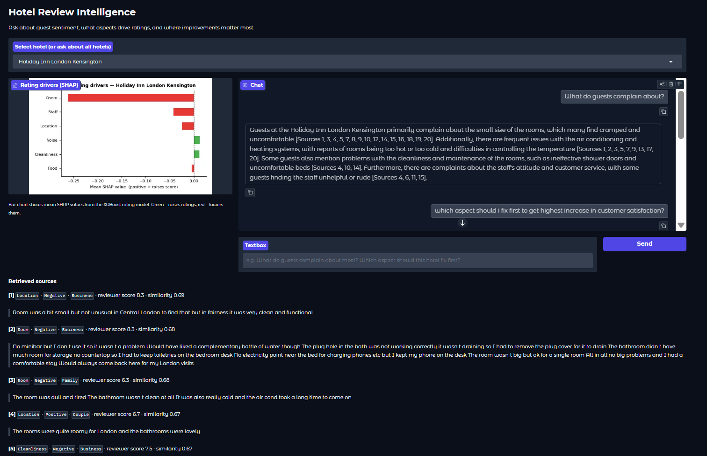

# Hotel Review Intelligence

**BT5153 Applied Machine Learning in Business Analytics — Group 16, NUS**

Turns 515k unstructured European hotel reviews into aspect-level sentiment signals, models which aspects drive guest ratings up or down using SHAP, and exposes it through a conversational agent hotel owners can query in plain English.



---

## Live demo

**[smridhv-conversational-hotel-review-intelligence.hf.space](https://smridhv-conversational-hotel-review-intelligence.hf.space)**

A trimmed demo is deployed on Hugging Face Spaces for evaluation. No setup required — open the link and start querying.

**Demo limitations vs. the full system:**

- Covers 5 hotels only (Britannia International, Strand Palace, Park Plaza Westminster Bridge, Copthorne Tara, Grand Royale London Hyde Park)
- Citations panel shows up to 5 sources per response, not the full retrieval set
- Vector store uses a numpy-backed cosine similarity engine rather than ChromaDB, to avoid Rust/C++ compilation on the HF build environment
- Multi-turn follow-up is slightly limited — HuggingFace Spaces manages conversation history differently from the local setup, so context carry-over across turns may be less reliable than the full local deployment
- **The live demo API key expires 12 May 2026** (NUS-provided key). After that date the demo will return errors; the full local deployment with your own key remains fully functional

**Access notes:**

- Allow 1–2 minutes on first load while the Space cold-starts
- Some corporate networks and university proxies block AWS WAF telemetry, which HuggingFace uses for bot protection. If the page loads blank, switch to a personal hotspot — the Space itself is running fine

---

## What it does

Five stages, end to end:

1. **Preprocessing** — splits each review's positive/negative text fields into sentences, tags reviewer segment (Business, Couple, Family, Solo, Group) from the `Tags` column
2. **Aspect extraction** — LDA topic modelling builds a keyword dictionary mapping words to six aspects: Cleanliness, Staff, Location, Noise, Food, Room
3. **Sentiment assignment** — keyword-matches each sentence to an aspect; sentiment comes from which field the sentence was in (positive vs. negative review text)
4. **Rating impact modelling** — Linear Regression + XGBoost trained on aspect feature vectors to predict reviewer scores; SHAP computed globally and per hotel
5. **ChromaDB ingestion** — embeds ~735k review sentences into `evidence_store` and SHAP narratives into `summary_store` via `text-embedding-3-small`

The agent sits on top: a LangGraph DAG with HyDE query expansion, stratified ChromaDB retrieval, and GPT-4o for response generation. Every answer cites the actual review sentences behind it.

---

## Quick start (evaluator — pre-computed outputs)

Fastest path. Download the pre-computed outputs from OneDrive and skip the 1–2 hour pipeline run.

### 1. Clone and install

```bash
git clone https://github.com/SmridhVarma/Hotel-Review-Intelligence-Aspect-Sentiment-and-Rating-Impact-Analysis.git
cd Hotel-Review-Intelligence-Aspect-Sentiment-and-Rating-Impact-Analysis

python -m venv .venv
.venv\Scripts\activate          # Windows
# source .venv/bin/activate     # Mac/Linux

pip install -r requirements.txt
```

### 2. Add your API key

```bash
copy .env.example .env
```

Open `.env` and fill in:

```
OPENAI_API_KEY=sk-...
```

### 3. Download from OneDrive

The OneDrive folder holds everything too large for GitHub:

```
OneDrive/BT5153_Group_Project/
├── data.xlsx                                    # raw 515k hotel reviews (228 MB)
├── Stage 1, EDA and Preprocessing Outputs/
│   ├── sentences.csv
│   └── clean_reviews_stage1.csv
├── Stage 2 Outputs/
│   └── aspect_dictionary.json
├── Stage 3 Outputs/
│   ├── aspect_sentences.csv
│   └── review_features.csv
├── Stage 4, Impact Analysis Outputs/
│   ├── shap_summary.json
│   └── evaluation_report.json
└── Stage 5, Agent/
    └── chromadb/                                # pre-built vector DB (~5.5 GB)
```

Where to put things:

| OneDrive path | Local path |
|---|---|
| `data.xlsx` | `data/data.xlsx` |
| `Stage 1, EDA and Preprocessing Outputs/*` | `outputs/` |
| `Stage 2 Outputs/*` | `outputs/` |
| `Stage 3 Outputs/*` | `outputs/` |
| `Stage 4, Impact Analysis Outputs/*` | `outputs/` |
| `Stage 5, Agent/chromadb/` | `chromadb/` (project root) |

### 4. Launch

Double-click `local_startup.bat`, or from the project root:

```
local_startup.bat
```

Checks your `.env`, checks ChromaDB (runs Stage 5 ingestion automatically if it is missing — ~$0.30, 20–40 min), then opens the Gradio UI at **http://localhost:7860**.

---

## Running the full pipeline from scratch

Requires `data/data.xlsx` from OneDrive. Skips any stage whose output files already exist.

```bash
python scripts/run_pipeline.py              # stages 1–5, ~1-2 hours
python scripts/run_pipeline.py --from 3    # resume from stage 3
python scripts/run_pipeline.py --only 5    # re-run ingestion only
```

Then launch:

```bash
local_startup.bat
```

---

## Evaluating the agent

ChromaDB must be populated and `.env` must have a valid API key.

```bash
python scripts/eval_agent.py
```

Runs 20 queries across all four query types, computes automatic metrics, and calls GPT-4o as a judge for relevance and context accuracy. Results go to `outputs/agent_eval_results.json`.

```
=== Module C Evaluation Summary ===
  Groundedness (citation coverage)             : 57.89%
  Relevance (GPT-4o judge, 1-5)                : 5.00 +/- 0.00
  Context accuracy (GPT-4o, 1-5)               : 4.30 +/- 1.05
  Resolution rate                              : 95.00%
  Mean retrieval similarity                    : 0.7159
```

---

## Project structure

```
BT5153_Group_Project/
│
├── data/
│   └── data.csv                        # 515k hotel reviews (download from OneDrive)
│
├── src/
│   ├── paths.py                        # single source of truth for all file paths
│   │
│   ├── absa/                           # Module A: Aspect-Based Sentiment Analysis
│   │   ├── preprocess.py               # Stage 1: sentence splitting, segment tagging
│   │   ├── aspect_extraction.py        # Stage 2: LDA topic model → aspect dictionary
│   │   └── sentiment_assignment.py     # Stage 3: keyword matching → labelled sentences
│   │
│   ├── rating_impact/                  # Module B: Rating Impact Modelling
│   │   ├── model.py                    # Stage 4: Linear Regression + XGBoost + SHAP
│   │   └── evaluate.py                 # Stage 4: RMSE/MAE/R², SHAP stability report
│   │
│   ├── agent/                          # Module C: Conversational Agent
│   │   ├── graph.py                    # LangGraph DAG — 8-node pipeline
│   │   ├── state.py                    # AgentState TypedDict shared across all nodes
│   │   ├── prompts.py                  # all LLM prompt templates
│   │   ├── ingest.py                   # Stage 5: embed sentences into ChromaDB
│   │   └── nodes/
│   │       ├── query_classifier.py     # GPT-4o: classifies query type, fuzzy hotel match
│   │       ├── segment_filter.py       # extracts reviewer segment (Business, Couple, etc.)
│   │       ├── hyde_expander.py        # HyDE: hypothetical review → embedding
│   │       ├── evidence_retriever.py   # queries evidence_store (sentence-level chunks)
│   │       ├── summary_retriever.py    # queries summary_store (SHAP narratives)
│   │       ├── context_merger.py       # merges sources, flags low-confidence responses
│   │       ├── response_generator.py   # GPT-4o: final answer with inline citations
│   │       └── state_manager.py        # appends turn to conversation history
│   │
│   └── ui/
│       └── app.py                      # Gradio chatbot (Module D)
│
├── scripts/
│   ├── run_pipeline.py                 # end-to-end pipeline orchestrator (stages 1–5)
│   └── eval_agent.py                   # agent evaluation: 20 queries + GPT-4o judge
│
├── outputs/                            # all pipeline artifacts (large files on OneDrive)
│   ├── sentences.csv                   # ~836k split sentences (Stage 1)
│   ├── clean_reviews_stage1.csv        # cleaned review text (Stage 1)
│   ├── aspect_dictionary.json          # LDA keyword → aspect mapping (Stage 2)
│   ├── aspect_sentences.csv            # sentence-level aspect + sentiment labels (Stage 3)
│   ├── review_features.csv             # review-level feature matrix (Stage 3)
│   ├── shap_summary.json               # per-hotel + global SHAP rankings (Stage 4)
│   ├── evaluation_report.json          # model RMSE/MAE/R² + SHAP stability (Stage 4)
│   ├── hotel_names.json                # hotel name list for fuzzy matching (Stage 5)
│   ├── agent_eval_results.json         # output of eval_agent.py
│   └── model_artifacts/
│       ├── linear_model.pkl
│       └── xgb_model.pkl
│
├── chromadb/                           # ChromaDB vector store (~5.5 GB, on OneDrive)
│   ├── evidence_store                  # ~735k embedded review sentences
│   └── summary_store                   # ~1,493 SHAP hotel narratives
│
├── notebooks/
│   ├── 01_stage1_preprocessing.ipynb   # EDA and Stage 1 walkthrough
│   ├── 02_report_figures.ipynb         # generates all report figures
│   └── 03_evaluation_metrics.ipynb     # Module A and B evaluation
│
├── docs/
│   ├── refs.bib                        # BibTeX references
│   ├── report_draft.md                 # report write-up
│   ├── architecture.md                 # pipeline and agent design detail
│   ├── dependencies.md                 # library choices and versions
│   └── figures/                        # all report and README figures
│
├── tests/                              # test stubs for all three modules
├── .env.example                        # template — copy to .env, add OPENAI_API_KEY
├── requirements.txt
└── local_startup.bat                   # Windows launcher: env check → ChromaDB → UI
```

---

## Agent query types

| Type | Example | Retrieval path |
|---|---|---|
| Evidence | "What do guests complain about regarding cleanliness?" | HyDE → evidence_store |
| Prioritisation | "Which aspect hurts this hotel's ratings most?" | summary_store (SHAP lookup) |
| Mismatch | "Which aspects show the biggest gap between text and score?" | summary_store |
| Segment | "What do business travellers say about the rooms?" | HyDE → evidence_store + segment filter |

---

## Dataset

515k European hotel reviews across 1,492 hotels. Not in the repo (228 MB).

Download `data.xlsx` from OneDrive and place it at `data/data.xlsx`.

Source: [515K Hotel Reviews Data in Europe — Kaggle](https://www.kaggle.com/datasets/jiashenliu/515k-hotel-reviews-data-in-europe)

---

## Course

BT5153 Applied Machine Learning in Business Analytics
National University of Singapore — Group 16
