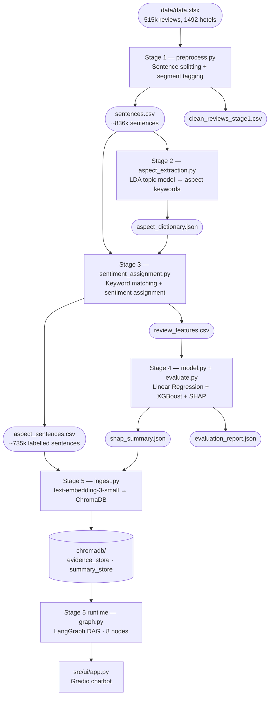
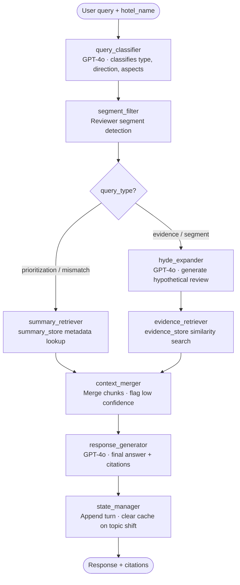

# Architecture

## Team

| Module | Owner(s) | Stages |
|---|---|---|
| Module A — ABSA | Frankie Yang Lin (Stage 1), Lu Qianqian (Stage 2), Wang Mengyu (Stage 3) | 1–3 |
| Module B — Rating Impact | Siddarth Mahesh | 4 |
| Module C — Conversational Agent | Smridh Varma, Mark Dodoo | 5 |
| Module D — UI | Smridh Varma | — |

---

## Pipeline overview

The system runs in five offline stages before the agent becomes available. Each stage feeds the next through well-defined CSV and JSON contracts.

```
data/data.xlsx  (515k reviews, 1,492 hotels)
      │
      ▼
Stage 1 — src/absa/preprocess.py
  Splits positive and negative review fields into individual sentences.
  Tags each sentence with source polarity, reviewer segment, and review ID.
  Outputs: outputs/sentences.csv, outputs/clean_reviews_stage1.csv
      │
      ▼
Stage 2 — src/absa/aspect_extraction.py
  Runs LDA topic modeling to build an aspect vocabulary dictionary.
  Maps topics to six target aspects: cleanliness, staff, location, noise, food, room.
  Outputs: outputs/aspect_dictionary.json
      │
      ▼
Stage 3 — src/absa/sentiment_assignment.py
  Keyword-matches each sentence to an aspect.
  Assigns sentiment from the source field (+1 positive / -1 negative / 0 not mentioned).
  Outputs: outputs/aspect_sentences.csv, outputs/review_features.csv
      │
      ▼
Stage 4 — src/rating_impact/model.py + evaluate.py
  Trains Linear Regression and XGBoost models on the aspect feature matrix.
  Computes SHAP values globally and per hotel.
  Outputs: outputs/model_artifacts/, outputs/shap_summary.json, outputs/impact_report.csv
      │
      ▼
Stage 5 — src/agent/ingest.py
  Embeds all sentences into ChromaDB evidence_store.
  Indexes SHAP narratives into ChromaDB summary_store.
  Outputs: chromadb/ (local persistent, gitignored)
      │
      ▼
Stage 5 (runtime) — src/agent/graph.py  (online, per query)
  LangGraph DAG — see node table below.
      │
      ▼
src/ui/app.py  (Gradio chatbot at localhost:7860)
```

---

## Visual pipeline

<!-- PIPELINE_DIAGRAM_START -->

<!-- PIPELINE_DIAGRAM_END -->

---

## LangGraph agent nodes

The agent is a directed graph of eight nodes. Each node receives the full `AgentState` dict and returns a partial update. State is typed in `src/agent/state.py`.

| Node | File | Responsibility |
|---|---|---|
| `query_classifier` | `nodes/query_classifier.py` | Parses query into structured fields: scope, query_type, query_direction, aspects, hotel_name, reviewer_segment. Uses GPT-4o with Pydantic validation; falls back to safe defaults on parse failure. |
| `segment_filter` | `nodes/segment_filter.py` | Detects reviewer segment from query text and sets the ChromaDB metadata filter. Falls back to unfiltered retrieval if no segment is detected. |
| `hyde_expander` | `nodes/hyde_expander.py` | Generates hypothetical ideal answers for embedding. Directional queries get one hypothetical; neutral queries get three (positive, negative, neutral) generated sequentially via synchronous `.invoke()` calls. |
| `evidence_retriever` | `nodes/evidence_retriever.py` | Embeds the hypothetical(s) and queries `evidence_store` with any active metadata filters. Neutral queries use stratified retrieval (7 docs per sentiment pole, deduplicated). |
| `summary_retriever` | `nodes/summary_retriever.py` | Fetches the SHAP narrative for the selected hotel (or `__global__`) from `summary_store`. Used for prioritization queries; bypasses embedding entirely. |
| `context_merger` | `nodes/context_merger.py` | Combines retrieved chunks and SHAP summary context. Sets `low_confidence=True` only on hard failures: hotel name unresolvable (fuzzy match confidence < 70), or both evidence chunks and summary context are empty. |
| `response_generator` | `nodes/response_generator.py` | Passes retrieved context to GPT-4o with a grounding prompt. Triggers the "cannot answer confidently" fallback when `low_confidence` is set. |
| `state_manager` | `nodes/state_manager.py` | Persists hotel context and conversation topic across turns. Resets on topic shift. Used for multi-turn follow-up queries. |

---

## Agent DAG

<!-- AGENT_DAG_START -->

<!-- AGENT_DAG_END -->

---

## ChromaDB collections

Two separate collections — one for raw evidence, one for model-level summaries. Routing is determined by `query_type`.

**`evidence_store`** (~735k documents)
- One document per sentence from Stage 3
- Embedded with `text-embedding-3-small` (1536 dimensions)
- Metadata: `hotel_name`, `aspect`, `sentiment`, `reviewer_segment`, `reviewer_score`
- Used by: `evidence_retriever`, `segment_filter`
- Query type: similarity search with optional metadata filters

**`summary_store`** (~1,493 documents)
- One document per hotel plus one `__global__` entry
- Content: human-readable SHAP narrative with aspect impact rankings
- Metadata: `hotel_name`, `review_count`, `insufficient_data`
- Used by: `summary_retriever`
- Query type: metadata `get()` — no embedding needed

**Routing rule:** `query_type in ("prioritization", "mismatch")` → `summary_store`; all other types → `evidence_store`.

**Schema contract** (enforced at ingest):
- `aspect`: `Cleanliness | Staff | Location | Noise | Food | Room`
- `sentiment`: `Positive | Negative | Neutral`
- `reviewer_segment`: `Business | Couple | Family | Solo | Group`

---

## Data flow contracts

| Produced by | Consumed by | File | Key columns |
|---|---|---|---|
| Stage 1 | Stage 2, 3 | `outputs/sentences.csv` | `review_id, hotel_name, sentence, source_polarity, reviewer_segment, reviewer_score` |
| Stage 3 | Stage 4, Stage 5 | `outputs/review_features.csv` | `review_id, hotel_name, reviewer_score, cleanliness, staff, location, noise, food, room` (values: +1/-1/0) |
| Stage 3 | Stage 5 | `outputs/aspect_sentences.csv` | `review_id, hotel_name, sentence, aspect, sentiment, reviewer_segment` |
| Stage 4 | Stage 5 | `outputs/shap_summary.json` | list of `{ hotel_name, aspect_impacts: { aspect: shap_value } }` |

---

## Supported query types

The agent handles four query patterns:

1. **Evidence** — "Why do guests complain about cleanliness?" Retrieves matching sentences from `evidence_store`.
2. **Prioritization** — "Which issue should this hotel fix first?" Fetches the SHAP ranking from `summary_store`.
3. **Mismatch** — "Which aspects show the biggest gap between text sentiment and score?" Fetches SHAP narrative from `summary_store` and highlights aspects where model attribution diverges from raw review volume.
4. **Segment** — "What do business travellers value most?" Applies a `reviewer_segment` metadata filter before retrieval.
5. **Follow-up** — Queries with no hotel name re-use the hotel context from the prior turn via `state_manager`.

**Out of scope (v1):** Cross-hotel comparisons. Queries like "compare Hotel Arena to Hotel X" fall back to global retrieval without flagging the scope mismatch. This is a known limitation.

---

## Retrieval modes

| Mode | Trigger | Source | Filter |
|---|---|---|---|
| Global | No hotel selected, or "all hotels" | `summary_store` `__global__` + unfiltered `evidence_store` | none |
| Per-hotel | Hotel selected in Gradio dropdown | `summary_store` hotel entry + `evidence_store` | `hotel_name` |
| Segment | Segment keyword in query text | Either mode above | `hotel_name` (if set) + `reviewer_segment` |

---

## Cost estimates

| Operation | Volume | Model | Estimated cost |
|---|---|---|---|
| Sentence embedding (Stage 5, once) | ~735k sentences × ~20 tokens | `text-embedding-3-small` | ~$0.30 |
| Per-query LLM calls | ~3–5 GPT-4o calls | `gpt-4o` | ~$0.01–0.02 per query |
| Agent eval run (20 queries + GPT-4o judge) | ~100 GPT-4o calls | `gpt-4o` | ~$0.10–0.20 |
